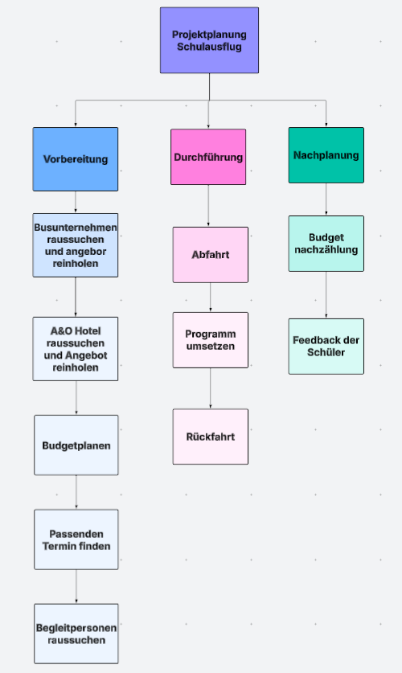

# Matthi2829-SWPP-3IT-Softwareentwicklung-und-Projektmanagement-2025-26

# **Projektplanung Schulausflug**

---

**Name:** Matthias Bauer, Klemens Kuen, Erion Prenaj 
**Klasse:** 3IT
**Fach:** Softwareentwicklung und Projektmanagement  
**Professor:** Dominik Neuner
**Abgabedatum:** 24. November 2025

---

**Schule:** Bundeshandelsakademie und Bundeshandelsschule Imst
**Schuljahr:** 2025/2026

# 1. Projektplanung Schulausflug #
## 1.1 Zusammenfassung Grundlagen ##
### 1.1.1 Definition Projekt ###

Ein Schulausflug ist ein zeitlich begrenztes Projekt, das einmalig durchgeführt wird und einen komplexen organisatorischen Umfang besitzt. Die zur Verfügung stehenden finanziellen und materiellen Ressourcen sind begrenzt, und ein klares Ziel für den Ausflug ist definiert: die sichere, sinnvolle und spaßige Durchführuang der Veranstaltung. Das Projektteam besteht aus Lehrkräften, Schülervertretern und ggf. externen Dienstleistern.
Zeitlich begrenzt: Der Ausflug findet an einem festgelegten Tag oder innerhalb eines kurzen Zeitraums statt.
Neu/einmalig: Jede Ausflugsplanung ist einzigartig, z. B. Ausflugsziel, Programm oder Teilnehmerzahl.
Umfang komplex: Planung von Transport, Verpflegung, Aktivitäten und Sicherheit.
Finanzielle & materielle Ressourcen begrenzt: Budget der Schule, Transportmittel, Eintrittsgelder.
Zieldefinition vorhanden: Gelungener, sicherer und lehrreicher/sinnvoller Ausflug für die Schüler.
Interdisziplinäres Team: Lehrkräfte, Schülervertreter, ggf. externe Partner (Busunternehmen, Veranstalter).
Definition von Projektzielen anhand der SMART-Formel
Spezifisch: Ziel des Projekts ist ein eintägiger Ausflug in den Tierpark XYZ für die Klasse 10b.
Messbar: Teilnahme von mindestens 95 % der Klasse, Rückmeldungen zur Zufriedenheit über eine Umfrage.
Attraktiv/Abgestimmt: Der Ausflug entspricht den Interessen der Schüler und den organisatorischen Vorgaben der Schule.
Realistisch: Kostenrahmen von 1.000 €, Transport durch Busunternehmen, einfache Mittagspause organisiert.
Terminiert: Ausflug findet am 15. Juni 2026 statt; Planung und Buchung müssen bis 31. Mai 2026 abgeschlossen sein.

### 1.1.2 Der Projektmanagement Prozess ###
Scope: Festlegung von Ziel, Anforderungen, Abnahmekriterien, Endtermin und Kostenrahmen.
Ziel: Sicherer und lehrreicher Ausflug.
Anforderungen: Transport, Verpflegung, Eintritt, Betreuung.
Kostenrahmen: Max. 1.000 €.
Endtermin: 15. Juni 2026.
Plan: Detaillierter Ablaufplan, Buchung von Bus und Eintrittskarten, Vorbereitung der Aktivitäten, Sicherheits- und Notfallplan.
Do: Durchführung des Ausflugs am geplanten Termin.
Check: Vergleich der Umsetzung mit Plan: Pünktlichkeit, Budgeteinhaltung, Schülerzufriedenheit.
Act: Anpassung für zukünftige Ausflüge basierend auf Feedback, z. B. Verbesserung von Pausen oder Verpflegung.
Result: Übergabe der Dokumentation an die Schulleitung und Auswertung der Ergebnisse als Referenz für zukünftige Projekte.

## 1.2 Zusammenfassung Projektorganisation ##
### 1.2.1 Rollen im Projekt ###
Auftraggeber: Schulleitung / Klassenleitung.
Projektleiter: Klassenlehrer/in 10b.
Projektmitarbeiter: Weitere Lehrkräfte, Schülervertreter.
Projektoffice: Verantwortlich für Dokumentation, Kommunikation mit Busunternehmen und Zoo.
Projektmanagementoffice (PMO): Schulverwaltung, unterstützt bei Budgetkontrolle.
Kunden: Schüler, Eltern, Lehrer.
Formen der Projektzusammenarbeit
Reine/Einfache Projekt-Organisation: Klassenlehrer voll verantwortlich, 100 % Einsatz für Organisation des Ausflugs.
Matrix-Projekt-Organisation: Lehrkräfte teilweise für den Ausflug zuständig, teilweise für regulären Unterricht.
Einfluss-Projekt-Organisation (Stab): Experten (z. B. Sicherheitsbeauftragter, Ernährungsberater) werden bei Bedarf angefragt.

## 1.3 Auftragsklärung ##
Wesentliches Erfolgskriterium: Alle organisatorischen Eckwerte (Transport, Budget, Sicherheit, Verpflegung) erfüllen die Anforderungen der Schüler und Lehrer.
Grobplanung: Busbuchung bis Ende Mai, Eintrittskarten besorgen, Aktivitätenliste erstellen.
Rollierender Verlauf: Anpassungen bei Änderungen der Schülerzahl oder Wetterbedingungen.

## 1.4 Magisches Dreieck ##
Projektkosten: Max. 1.000 €.
Projektdauer: Ein Tag (15. Juni 2026).
Projektanforderungen/Qualität: Sicherer, lehrreicher und spaßiger Ausflug.
Wechselwirkung: Wird das Budget überschritten, muss z. B. die Verpflegung angepasst werden, ohne dass die Qualität leidet.

## 1.5 Moscow-Methode ##
Must: Transport und Eintritt für alle Schüler, Sicherheit gewährleisten.
Should: Mittagspause organisieren, Aktivitäten abwechslungsreich gestalten.
Could: Souvenir oder kleine Geschenke für Schüler.
Won’t: Luxusangebote wie private Führungen oder teure Extras.

